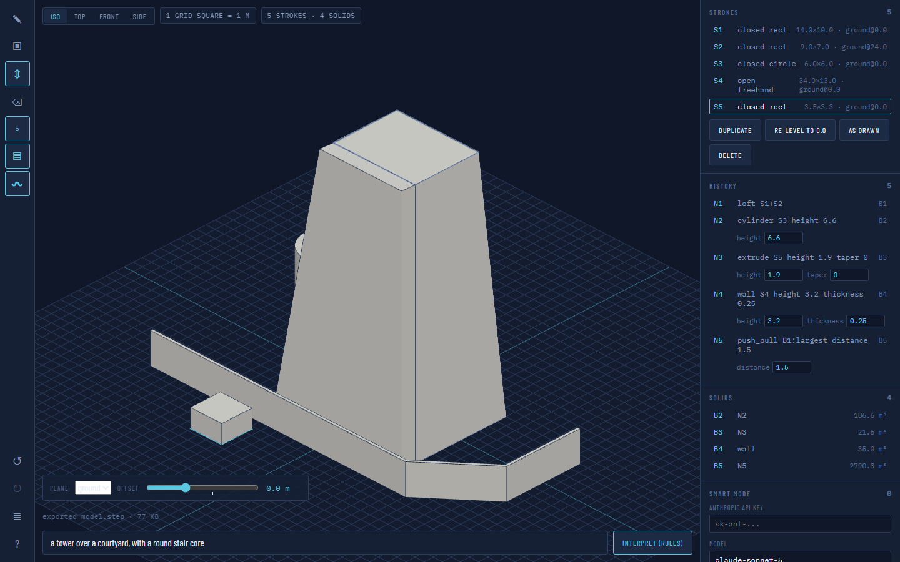

# Sketch → Solid

Sketch strokes in 3D and turn them into **real B-rep solids** — backed by
OpenCascade (the same class of kernel as FreeCAD's, compiled to WebAssembly) and
a **parametric history graph**, so the results are robust, editable, and export
to professional CAD as STEP.

A static site. No backend, no accounts, no persistence beyond the URL.



---

## What it is

Draw on a sheet — ground, front or side plane, at any height — then press
**Interpret**. Strokes become operations; operations become solids.

Two things make it work:

- **A real kernel.** Booleans, fillets, shells, lofts, sweeps and NURBS come from
  OpenCascade, not from a mesh library. A subtraction of two extrusions
  round-trips through STEP into Rhino, Revit or FreeCAD as a solid, with its
  volume preserved to within 0.1%.
- **A history graph that is the document.** Nothing is ever edited in place.
  Every solid is the output of an editable program of operations, so
  `make the tower 40 m` is an `edit` on one node, and everything downstream —
  the boolean, the fillet — re-evaluates. Undo, redo, sharing and LLM iteration
  all operate on that graph.

It deliberately does *not* have vertex-level editing. An LLM cannot meaningfully
grab vertices, and the history graph is what makes both human and model editing
reliable. Direct manipulation is at the face level (push/pull), and that records
into history too.

## Running it

```sh
npm install
npm run dev            # http://localhost:5173
npm test               # 69 tests, including the kernel under Node
npm run smoke          # builds, then drives the real app in Chrome
```

`npm run smoke` needs a Chrome or Chromium binary; point `CHROME_PATH` at it if
it is not at the Windows default.

## Using it

The app opens on an example scene. Press **Interpret** with no API key and the
built-in rule interpreter reads it: stacked outlines become a loft, a circle
becomes a cylinder, an open line becomes a wall. Paste an Anthropic API key into
**Smart mode** and Interpret talks to the model instead — same operations, same
execution path, but it can also use selectors (`the top face`, `the vertical
edges`) and `edit` earlier nodes.

| | |
|---|---|
| `D` `V` `P` `E` | draw · select · push-pull · erase |
| `1` `2` `3` `4` | iso · top · front · side |
| drag | draw on the sheet, or straight onto a face of a solid |
| `Shift` while drawing | lock to the nearer sheet axis |
| `S` | snapping: 0.5 m grid, endpoints, auto-close |
| drag a stroke / empty space | move the selection · marquee select |
| arrows, `[` `]`, `Ctrl+D` | nudge · re-level · duplicate |
| `Ctrl+Z` / `Ctrl+Shift+Z` | undo · redo, across strokes and history alike |
| right-drag, middle-drag, wheel | orbit (iso only) · pan · zoom |
| `F`, `?` | frame everything · help |

The **History** panel is the model. Every scalar in it is editable in place, and
the graph re-evaluates as you type. A node whose selector stops matching turns
redline and says why; downstream nodes stall, nothing crashes.

## The key is yours

The API key is typed by you, held in a JavaScript variable for the session only,
and sent nowhere except `api.anthropic.com` (direct from the browser, with
`anthropic-dangerous-direct-browser-access`). It is never written to
localStorage, never put in the URL, and never leaves with a share link.

## Sharing and export

**Share** deflates the whole document — strokes plus history graph plus intent —
into the URL fragment. The receiver re-evaluates the graph in their own browser:
you are sharing the model *as a program*, not as a mesh.

**Export** writes STEP (real solids, the professional path), plus OBJ, STL and
GLB for everything else.

## How it is put together

```
src/
  core/         types, plane bases            the three sketch planes, right-handed
  sketch/       capture, filters, beautify    one-euro smoothing, RDP, shape fitting
  scene/        viewport, sheet, display      Three.js; renders kernel tessellations
  kernel/       worker, occ, build, selectors OCCT lives here and nowhere else
  graph/        model, serialize              the history graph; the document format
  ops/          registry, defs/, effects      one file per operation
  llm/          prompt, client, ndjson        streaming NDJSON, one validation retry
  interpret/    heuristics                    the no-key interpreter
  ui/           rail, hud, panel, dialogs     no framework, panels only
  share/        urlhash, export
```

Three ideas hold it together:

**The registry is the single source of truth for capability.** Every operation is
an `OpDef` in `src/ops/defs/`. The LLM's system prompt, the validator, the
Capabilities drawer and the executor are all generated from it. Four tests
(`tests/ops.test.ts`) assert that every op appears in the prompt, that every
example validates, that every example builds non-empty geometry through the real
kernel, and that the prompt stays inside its token budget. Those tests are what
prevent capability drift; adding a def file is the only step needed for the model
to gain an ability.

**Sub-object references are declarative queries, never indices.** Topological
naming is the classic unsolved problem of history-based CAD. This app dodges the
worst of it: `{"solid":"B2","kind":"face","select":"top"}` is resolved fresh at
every evaluation. A query that stops matching produces a readable error on that
node — shown to you, and shown to the model on its next turn. It is also more
LLM-friendly than indices: the model asks for "the top face", which is what it
actually means.

**Evaluation is memoised by chain hash.** Nodes run in dependency order against
an environment of live solids. Node *i*'s hash covers everything up to and
including it, so editing node 5 of 10 re-runs five nodes, not ten, and unchanged
solids are not even re-tessellated.

## Kernel payload

The kernel is the price of admission: `opencascade.full.wasm` is 50 MB
(≈14 MB gzipped). It is handled as follows:

- fetched with a **progress bar** in the HUD, after first paint;
- cached by a **service worker**, so the cost is paid once per visitor;
- run in a **Web Worker**, so the sketch side of the app stays fully interactive
  while it loads — Interpret simply queues until the kernel is ready.

GitHub Pages cannot set COOP/COEP, so there is no `SharedArrayBuffer` and the
WASM is single-threaded. The worker exists to keep the UI thread alive, not for
parallelism.

## Deploying

Push to `main`. The workflow runs `npm ci`, `npm test`, `npm run build` with
`BASE_PATH` taken from the repository name, and deploys `dist/` to Pages. `base`
is never hardcoded, and the `.wasm` is fetched through
`new URL(..., import.meta.url)` so the base path applies.

## Known limits, stated plainly

- **The kernel is the full build, not a custom one.** Trimming OCCT to only the
  needed modules would roughly halve the payload, but `opencascade.js` custom
  builds require Docker, which is out of reach of this repo's build. The
  lazy-load, progress bar and service-worker cache are all in place, so the cost
  is paid once; the file itself is bigger than it needs to be.
- **`network_surface` skins rather than fills.** It lofts through the denser
  stroke family (`BRepOffsetAPI_ThruSections`) instead of using
  `BRepOffsetAPI_MakeFilling`, because MakeFilling needs a closed boundary
  contour that freehand grids almost never provide. The result is a surface
  through your strokes; thicken it with `shell` as usual.
- **Face picking maps onto the three named planes.** Drawing on a face of a solid
  works when that face is roughly axis-aligned — which covers the tops and sides
  of everything the create ops make. On a strongly angled face the stroke falls
  back to the active sheet.
- **OCCT shapes are retained for the session.** Superseded shapes are not freed
  from the WASM heap, so a very long editing session grows memory. Reloading
  clears it; the document is in the URL.
- **Not implemented (spec P6, stretch):** live symmetry drawing, the reference
  image underlay, and voice input.

## Anti-goals

No accounts, no server, no persistence beyond the URL hash. No sculpting, no
subdivision or vertex-level editing, no modifier zoo, no rendering engine, no
materials, no drafting or dimensioning, no surface-continuity tooling, no file
import. When in doubt: a parametric solid modeller you drive by sketching and
talking — not a Blender clone, not a Rhino clone.

## Licence

MIT for this repository. `opencascade.js` and OpenCascade itself are LGPL-2.1.
